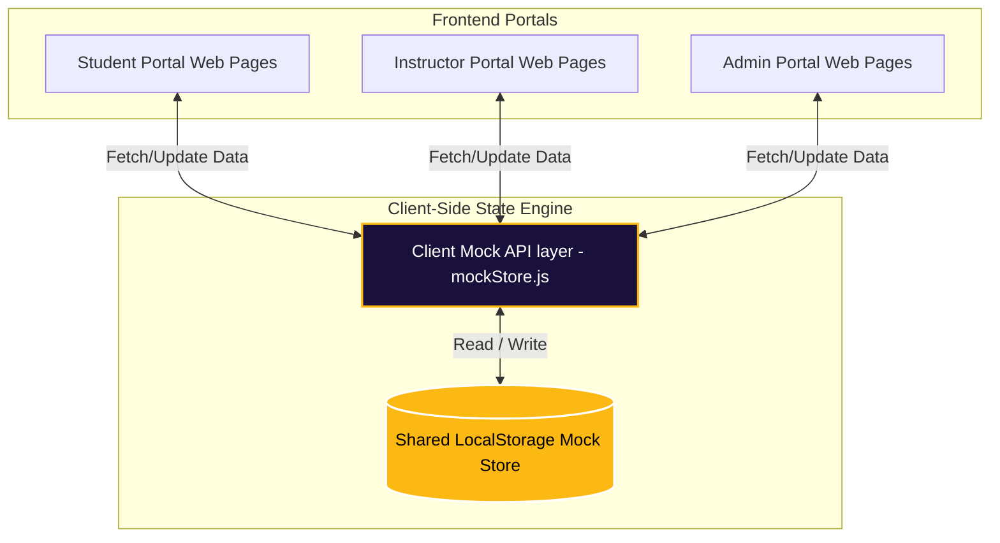

# INNOVATION UNIVERSITY SYSTEM (IUS)
## 🚀 Frontend Master Roadmap & Architecture Plan

This document serves as the official, comprehensive frontend roadmap for the **Innovation University System (IUS)**. Following a dynamic Navy & Gold "Royal Glass" design system, the plan concentrates 100% on completing and perfecting the frontend portals for **Students**, **Administrators**, and **Instructors** before initiating backend database integrations.

---

## 📊 Status Board: Finished vs. Remaining Portals

Below is the verification grid showing completed components versus remaining tasks for the three primary portals.

| Portal | Component / Page | Status | Description / Completed Features | Next Steps (Remaining Frontend) |
| :--- | :--- | :--- | :--- | :--- |
| **Student Portal** | Dashboard (`dashboard-STU.html`) | ✅ **Completed** | Full stats grid, sidebar integration, interactive Chart.js widgets. | Connect to central client-side mock store. |
| | Assignments (`assignments.html`) | ✅ **Completed** | Upload zone, status badges, dynamic deadline calendar. | Mock local storage save states. |
| | Results (`result.html`) | ✅ **Completed** | GPA summary cards, detailed subject tables, trend charts, Print Transcript button. | Implement mock PDF download trigger. |
| | Hubs (PDFs, Videos, Quizzes) | ✅ **Completed** | Organized hub-pages under levels 1-4. YouTube embeds, Quiz engine. | Complete level 4 content pages. |
| | Profiles & Settings | ⚠️ **In Progress** | Standard profile pages exist. | Create dynamic "Edit Profile" local state update. |
| **Admin Portal** | Dashboard (`dashboard-admin.html`) | ✅ **Completed** | Overall statistics, metrics counters, dark royal theme. | Integrate CRUD controls. |
| | Attendance Control (`admin-attendance.html`) | ✅ **Completed** | Admin grid for reviewing attendance status. | Enable interactive mock checks. |
| | Insights (`admin-insights.html`) | ✅ **Completed** | Advanced metrics charts using Chart.js. | Link charts dynamically to mock data. |
| | CRUD Management | 🔴 **Remaining** | None | Build a centralized dashboard view for admins to Add/Edit/Delete courses & students. |
| **Instructor Portal** | Dashboard (`dashboard-instructor.html`) | ⚠️ **In Progress** | Basic layout and portal container created. | Finalize UI aesthetics to match Royal Glass theme. |
| | Grade Sheet Entry | 🔴 **Remaining** | None | Design a grid page for instructors to input grades for courses. |
| | Attendance Sheet Generator | 🔴 **Remaining** | None | Design a premium class list with checkboxes for instant attendance recording. |
| | Class Announcements | 🔴 **Remaining** | None | Add a simple announcement broadcast editor. |

---

## 👥 Proposed Role Divisions (Optimal 3-Person Team)

To maximize velocity and ensure pixel-perfect delivery, the work is divided into three distinct frontend roles:

### 🎨 Role 1: Frontend UI/UX Engineer (Aesthetics Specialist)
* **Focus:** Visual excellence, premium look-and-feel, responsiveness, CSS styling.
* **Key Tasks:**
  * Bring the **Instructor Portal** dashboard and its sub-pages to the same high-fidelity Royal Glass visual standards as the Student portal.
  * Ensure mobile responsiveness on all complex data tables (Grades, Attendance, Schedules).
  * Design smooth micro-animations and hover transitions for all dashboards.

### ⚙️ Role 2: Interactivity & Client-Side Logic Developer (JS Specialist)
* **Focus:** Dynamic charts, state management, client-side data simulation.
* **Key Tasks:**
  * Build a **Centralized Mock Data Store (`mockStore.js`)** in the browser to act as a temporary local database (using `localStorage`).
  * Ensure that taking a quiz in the Student portal, updating attendance in the Admin portal, or inputting grades in the Instructor portal all write to this shared Mock Store, instantly updating charts and views in real-time.
  * Connect Chart.js components to fetch from the mock store dynamically.

### 📐 Role 3: Quality Assurance & Lead Systems Architect (Integration Specialist)
* **Focus:** Link integrity, routing, file organization, unifying branding.
* **Key Tasks:**
  * Run systematic link audits to ensure zero broken links across all 98+ HTML files.
  * Oversee favicon injection and unified footer versioning across the entire ecosystem.
  * Manage transitions between pages, loader screens, and session check simulations.

---

## 🗺️ Shared Client-Side Architecture (Frontend Mock Flow)

To ensure the 10+ portals share the exact same data source in the frontend phase, we will implement a centralized **Client-Side State Engine** running on the browser's local storage. This perfectly prepares the code for instant backend integration later.

---

## 📅 Roadmap: Phased Implementation Plan

### 📍 Phase 1: Perfecting the Student Portal (Est. Duration: 2-3 Days)
* **Goal:** Complete and polish every single student feature.
* **Action Items:**
  * Perfect the "Edit Profile" local state update.
  * Complete missing Level 4 subjects, video hubs, and quizzes.
  * Test results transcript printing and simulation of downloading PDF.

### 📍 Phase 2: Building the Instructor Portal (Est. Duration: 4-5 Days)
* **Goal:** Create a stunning, premium suite for lecturers.
* **Action Items:**
  * Modernize the instructor dashboard layout to match the Navy & Gold Royal Glass system.
  * **Grade Entry Interface:** Create a highly readable spreadsheet-like table where lecturers can select a course and enter student scores.
  * **Attendance Sheet:** Create a list with interactive checkboxes for taking quick roll calls, saving the output.
  * **Announcements Board:** Create a dynamic board where instructors post course announcements.

### 📍 Phase 3: Perfecting the Admin Portal (Est. Duration: 3-4 Days)
* **Goal:** Finalize the administrator management tools.
* **Action Items:**
  * **Student/Course Management (CRUD):** Design mock views for adding new students, assigning them to levels, and adding new courses.
  * Connect the Admin attendance tracker to view what instructors record.
  * Link insights charts to dynamic university stats.

### 📍 Phase 4: Global QA & Polish (Est. Duration: 2 Days)
* **Goal:** Eliminate bugs, broken links, and consolidate branding.
* **Action Items:**
  * Run the `link_checker.js` script to resolve any broken URLs.
  * Inject the `add_favicon.js` and `fix_all_footers.js` scripts to ensure 100% uniformity.
  * Optimize preloader screens and transition animations.

### 📍 Phase 5: Client Handover & Backend Setup Plan
* **Goal:** Package the frontend and design the backend implementation plan (Supabase / local Node.js Server).

---

> [!NOTE]
> All frontend views will be developed using pure HTML5, vanilla CSS3, and standard Javascript to maintain maximum compatibility, flexibility, and blazing-fast loading speeds.

> [!TIP]
> By storing our mock data in a singular Javascript file (`mockStore.js`), transitioning to a database later will simply require replacing the mock functions with actual `fetch()` calls to the backend APIs!
